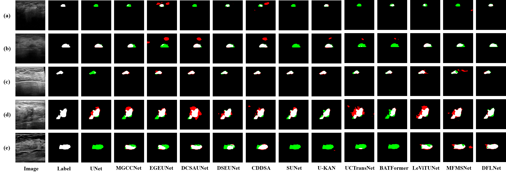

# DFLNet: Disentangled Feature Learning Network for Breast Cancer Ultrasound Image Segmentation
⭐ This code has been completely released ⭐ 
[Paper Link](https://www.sciencedirect.com/science/article/pii/S1051200425003537) 

## Overview

<p align="center"> 
     
</p>

## Requirements

```python
Python 3.6
Pytorch 1.7.0
```


## Datasets Preparation

- The download link for the datasets is [here](https://pan.baidu.com/s/1xDJLwiz8rXPEYfXM1gPw2g?pwd=rajx). Put the datasets as follows:
```python
DFLNet
├── BUSI-WHU
│   ├── train
│   │   ├── img
│   │   │   ├── 00001.bmp
│   │   │   ├── 00002.bmp
│   │   │   ├── .....
│   │   ├── gt
│   │   │   ├── 00001.bmp
│   │   │   ├── 00002.bmp
│   │   │   ├── .....
│   ├── valid
│   │   ├── img
│   │   │   ├── 00009.bmp
│   │   │   ├── 00015.bmp
│   │   │   ├── .....
│   │   ├── gt
│   │   │   ├── 00009.bmp
│   │   │   ├── 00015.bmp
│   │   │   ├── .....
│   ├── test
│   │   ├── img
│   │   │   ├── 00007.bmp
│   │   │   ├── 00008.bmp
│   │   │   ├── .....
│   │   ├── gt
│   │   │   ├── 00007.bmp
│   │   │   ├── 00008.bmp
│   │   │   ├── .....
```

## Train

Modify the paths in lines 22 to 30 of the train.py, then simply run:

```python
python train.py
```

- The download link for the pretrain_pth is [here](https://pan.baidu.com/s/1Yn5vZEPhtJXE57x3jVV21Q?pwd=rdeg).

## Test

Modify the paths in lines 14 to 15 of the eval.py, then simply run:

```python
python eval.py
```

## Visualization

Modify the paths in lines 13 to 17 of the visualization.py, then simply run:

```
python visualization.py
```

- Note that batch-size must be 1 when using visualization.py
- Besides, you can adjust the parameter of full_to_color to change the color

## Visual Results

<p align="center"> 
     
</p>


## Citation

If you find the code helpful in your research or work, please cite the following paper:

```
@article{ye2025dflnet,
  title={DFLNet: Disentangled Feature Learning Network for Breast Cancer Ultrasound Image Segmentation},
  author={Ye, Zhaoyi and Huang, Jin and Zhang, Yimin and Deng, Jingwen and Zhang, Jingwen and Liu, Sheng and Wang, Du and Mei, Liye and Lei, Cheng},
  journal={Digital Signal Processing},
  pages={105331},
  year={2025},
  publisher={Elsevier}
}
```
